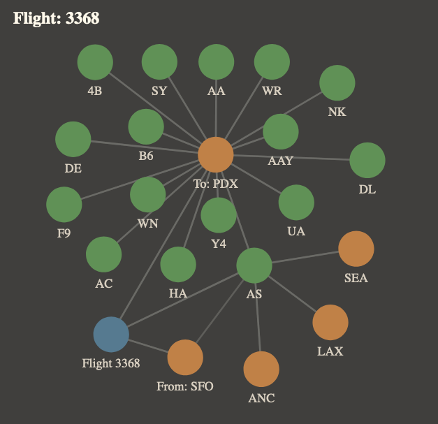
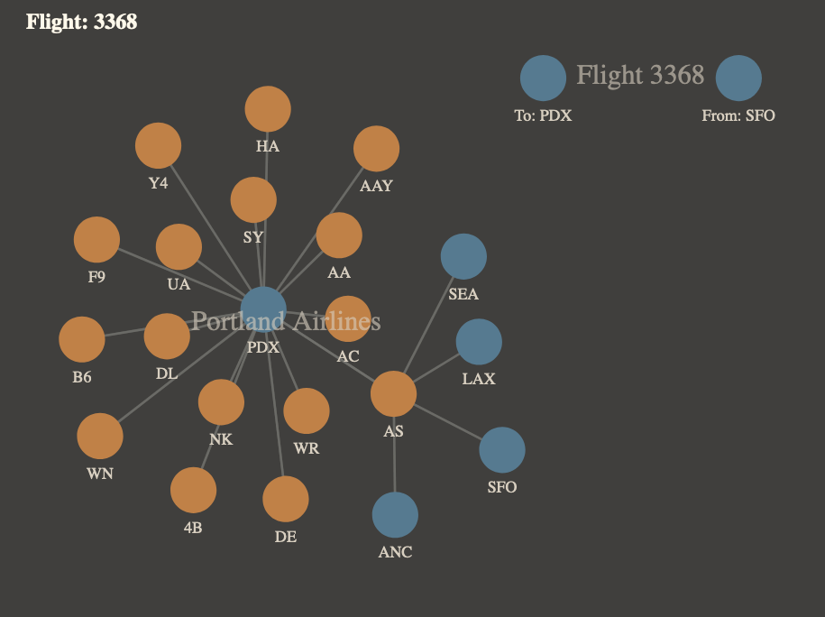

## React D3 Graph
A React component which handles converting a root object and a collection of [jmespath](https://jmespath.org/) queries into a list of nodes, links and groups.

## Install
```
yarn add @tlowerison/react-d3-graph
```
## Example
A small example graph with deeply nested data can be put together really quickly with the `Graph` component. Both plots come from the same data (shown at the end); the idea is that the root object contains information about a flight on Alaska Airlines from San Francisco International Airport (SFO) to Portland International Airport (PDX). The nested Alaska Airlines object contains a list of it five hubs, and in the PDX airport object in that hub list, there is a list of all airlines that flying out of PDX.

#### Display graph with a root node


```tsx
import React from "react";
import { Graph, GraphLinkDirection } from "@tlowerison/react-d3-graph";
import { data } from "./data";

export const FlightGraph = () => (
  <>
    <h2>Flight: {data.code}</h2>
    <Graph
      idField="uuid"
      defaultNameField="code"
      fontSize={{ nodeName: 7 }}
      root={data}
      config={{
        name: ({ code }) => `Flight ${code}`,
        links: [
          {
            nodes: [
              {
                path: "from",
                name: ["code", (code: string) => `From: ${code}`],
              },
              {
                path: "to",
                name: ["code", (code: string) => `To: ${code}`],
              },
            ]
          },
          {
            nodes: [{
              path: "airline",
              links: [{
                direction: GraphLinkDirection.None,
                nodes: [{
                  path: "hubs",
                  links: [{
                    direction: GraphLinkDirection.None,
                    nodes: [{
                      path: "airlines",
                    }],
                  }],
                }],
              }],
            }],
          },
        ],
      }}
    />
  </>
);
```

#### Display Graph without a root node


```tsx
import React from "react";
import { Graph, GraphLinkDirection } from "@tlowerison/react-d3-graph";
import { data } from "./data";

export const FlightGraph = () => (
  <>
    <h2>Flight: {data.code}</h2>
    <Graph
      idField="uuid"
      defaultNameField="code"
      fontSize={{ nodeName: 7 }}
      root={data}
      config={[
        {
          name: "Flight 3368",
          nodes: [
            {
              path: "from",
              name: ["code", (code: string) => `From: ${code}`],
            },
            {
              path: "to",
              name: ["code", (code: string) => `To: ${code}`],
            },
          ]
        },
        {
          name: "Portland Airlines",
          nodes: [{
            path: "airline",
            links: [{
              direction: GraphLinkDirection.None,
              nodes: [{
                path: "hubs",
                links: [{
                  direction: GraphLinkDirection.None,
                  nodes: [{
                    path: "airlines",
                  }],
                }],
              }],
            }],
          }],
        },
      ]}
    />
  </>
);
```

#### Example Data used above
```ts
// data.ts
export const data = {
  __typename: "Flight",
  uuid: "0000-00000-0001",
  code: "3368",
  from: {
    __typename: "Airport",
    uuid: "0000-00000-0002",
    name: "San Francisco International Airport",
    city: "San Francisco, CA, United States",
    code: "SFO",
  },
  to: {
    __typename: "Airport",
    uuid: "0000-00000-0003",
    name: "Portland International Airport",
    city: "Portland, OR, United States",
    code: "PDX",
  },
  departure: "2021-01-01T06:00:00.000Z",
  arrival: "2021-01-01T20:00:00.000Z",
  airline: {
    __typename: "Airline",
    uuid: "0000-00000-0004",
    name: "Alaska Airlines",
    code: "AS",
    hubs: [
      {
        __typename: "Airport",
        uuid: "0000-00000-0005",
        name: "Los Angeles International Airport",
        city: "Los Angeles, CA, United States",
        code: "LAX",
      },
      {
        __typename: "Airport",
        uuid: "0000-00000-0006",
        name: "Seattle-Tacoma International Airport",
        city: "Seattle, WS, United States",
        code: "SEA",
      },
      {
        __typename: "Airport",
        uuid: "0000-00000-0007",
        name: "Ted Stevens Anchorage International Airport",
        city: "Anchorage, AK, United States",
        code: "ANC",
      },
      {
        __typename: "Airport",
        uuid: "0000-00000-0002",
        name: "San Francisco International Airport",
        city: "San Francisco, CA, United States",
        code: "SFO",
      },
      {
        __typename: "Airport",
        uuid: "0000-00000-0003",
        name: "Portland International Airport",
        city: "Portland, OR, United States",
        code: "PDX",
        airlines: [
          {
            __typename: "Airline",
            uuid: "0000-00000-0004",
            name: "Alaska Airlines",
            code: "AS",
          },
          {
            __typename: "Airline",
            uuid: "0000-00000-0008",
            name: "Air Canada",
            code: "AC",
          },
          {
            __typename: "Airline",
            uuid: "0000-00000-0009",
            name: "Allegiant Air",
            code: "AAY",
          },
          {
            __typename: "Airline",
            uuid: "0000-00000-0010",
            name: "American",
            code: "AA",
          },
          {
            __typename: "Airline",
            uuid: "0000-00000-0011",
            name: "Boutique Air",
            code: "4B",
          },
          {
            __typename: "Airline",
            uuid: "0000-00000-0012",
            name: "Condor",
            code: "DE",
          },
          {
            __typename: "Airline",
            uuid: "0000-00000-0013",
            name: "Delta Air Lines",
            code: "DL",
          },
          {
            __typename: "Airline",
            uuid: "0000-00000-0014",
            name: "Frontier Airlines",
            code: "F9",
          },
          {
            __typename: "Airline",
            uuid: "0000-00000-0015",
            name: "Hawaiin",
            code: "HA",
          },
          {
            __typename: "Airline",
            uuid: "0000-00000-0016",
            name: "JetBlue",
            code: "B6",
          },
          {
            __typename: "Airline",
            uuid: "0000-00000-0017",
            name: "Southwest Airlines",
            code: "WN",
          },
          {
            __typename: "Airline",
            uuid: "0000-00000-0018",
            name: "Spirit Airlines",
            code: "NK",
          },
          {
            __typename: "Airline",
            uuid: "0000-00000-0019",
            name: "Sun Country Airlines",
            code: "SY",
          },
          {
            __typename: "Airline",
            uuid: "0000-00000-0020",
            name: "United Airlines",
            code: "UA",
          },
          {
            __typename: "Airline",
            uuid: "0000-00000-0021",
            name: "Volaris",
            code: "Y4",
          },
          {
            __typename: "Airline",
            uuid: "0000-00000-0022",
            name: "WestJet Encore",
            code: "WR",
          },
        ],
      },
    ],
  },
};
```
